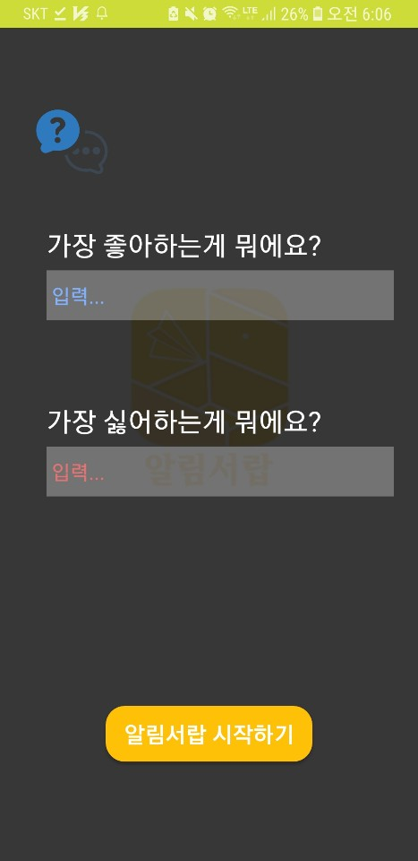
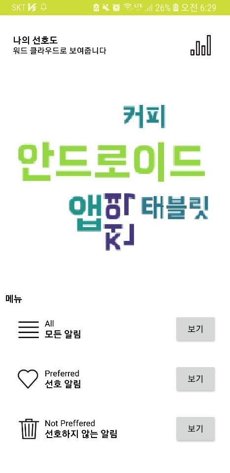
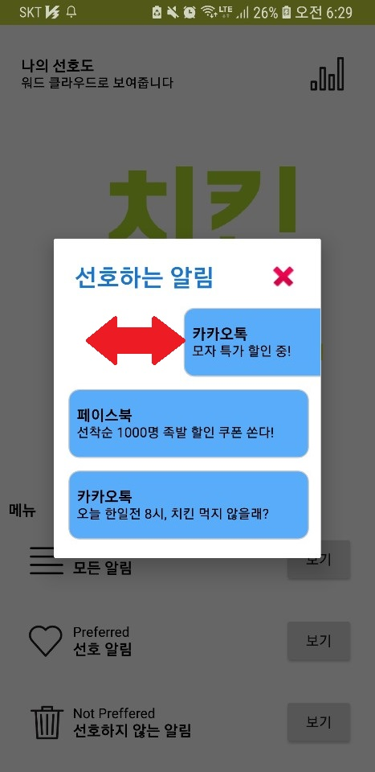
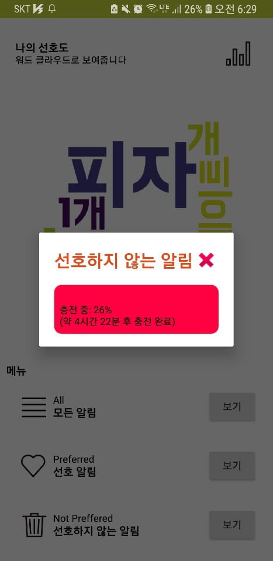
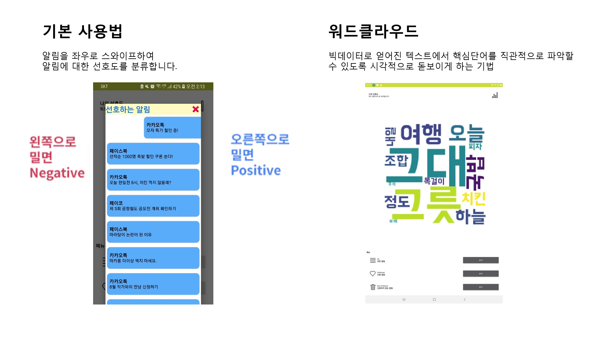
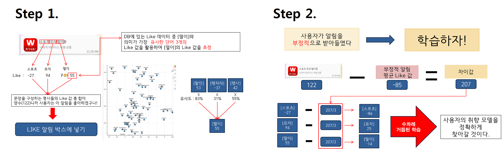
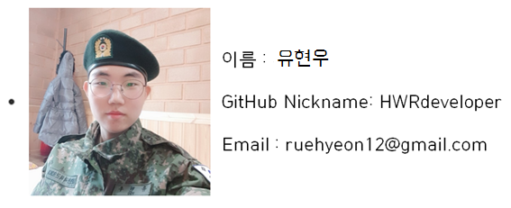

<p align="center">
    
</p>

<p align="center">
	<a href="https://github.com/osam2019/APP_AlimSeolap_Team/releases"></a>
	
	<a href="https://github.com/osam2019/APP_AlimSeolap_Team/releases"></a>
	<a href="https://github.com/osam2019/APP_AlimSeolap_Team/blob/master/LICENSE"></a>
</p>

## 개요

알림서랍의 탄생은 아주 일상적인 순간에서 시작됩니다. 스마트폰을 켰는데 많은 알림들이 와있어 상태바가 지저분해져 있는 그 순간이요. **알림들 중에는 유용한 알림들도 몇 있지만 대다수는 불필요한 정보의 알림**입니다. 그래서 생각했습니다. 

<br>

> #### 이 많은 알림들 중에서 내게 딱 필요한 알림들만 확인할 순 없을까?

이 질문으로 알림서랍은 세상으로 나왔습니다. 알림서랍은 **스마트폰에 무작위로 밀려드는 푸시 알림들을 당신의 취향에 맞춰 필터링 해주는 앱**입니다. 사용하면 사용할수록 정교해지는 알림서랍 서비스를 이용해보세요!

<br>

## 주요기능
<table>
	<tr><td></td><td></td><td></td><td></td></tr>
	<tr><td><b>앱 처음 실행 시</b></td><td><b>앱 메인 화면</b></td><td><b>사용자 추천 알림</b><br>좌우로 스와이프하여 좋아요 또는 싫어요를 할 수 있다.</td><td><b>사용자 비추천 알림</b></td></tr>
</table>

<br>

## 사용법


<br>

## 설치 안내
 * **Application**
   - [Download Release Source / APK](https://github.com/osam2019/APP_AlimSeolap_Team/releases)
   - Dependancy
     - JDK `(>=8)`
     - Android Studio `(>=3)`
     - compileSdkVersion `29`
     - minSdkVersion `26`
 * **Backend**
   - Command `linux`
   ```
   $ git clone https://github.com/noti-dropper/backend.git
   $ cd backend
   $ python server.py  #디펜던시 설정 후 실행
   ```
   
   - Dependancy
     - Python `(>=3.5)`
     - JDK `(>=8)`
     - pip install
       - flask
       - flask_restful
       - konlpy
       - gensim
       - matplotlib
       - wordcloud
   - 서버 구동
     ```bash
     $ python -m pip install {의존성 관련 라이브러리 설치}
	 $ python server.py
     ```

<br>

## Application Learning Algorithm


<br>

## Backend API
- `POST` **/api/analyze-sentence**

  - **object** *(body)*: 

  ```javascript
  {
      "sentence": "입력할 문장"
  }
  ```


  - **response**

  ```javascript
  {
      "result": ["결과값 리스트(배열)"]
  }
  ```


- `POST` **/api/similarity-analysis**

  - **object** *(body)*:

  ```javascript
  {
   "request_noun": ["오늘", "치킨"],
   "total_nouns" : ["신발", "피자", "행사"]
  }
  ```

  request_noun : 의뢰하고자 하는 명사 리스트
  total_nouns : 가지고 있는 명사 리스트

  - **response**

  ```javascript
  {
      {
      '오늘': {'신발': 0.08428423, '피자': 0.105281755, '행사': 0.2277687}, 
      '치킨': {'신발': 0.06422423, '피자': 0.6277687, '행사': 0.105281755}
      }
  }
  ```

  명사 간의 유사도를 json 형식으로 반환

  

- `POST` **/api/get-wordcloud**

  - **object** *(body)*:

  ```javascript
  {
      "치킨": 7.56,
      "피자": 6.01,
      "목걸이": -0.0056,
      "일본": -2.6486
  }
  ```
  
  total 명사와 그 명사의 value 값을 json 형식으로 전송

  value 절대값이 클수록 큰 글자로 표현됨.

  - **response**


<br>

## Repositories
 - **App-Core** `Android/java`
   - 애플리케이션 핵심 소스 코드
   - DB 관리, Notification 수집, API 통신 기능
   - [Network](https://github.com/noti-dropper/app-core/network)
 - **App-UI** `Android/java`
   - 애플리케이션 UI
   - [Network](https://github.com/noti-dropper/app-ui/network)
 - **Backend** `Flask/python`
   - 백엔드 API 
   - 자연어 처리, 명사 유사도 검사, Word-Cloud 생성 기능
   - [Network](https://github.com/noti-dropper/backend/network)

<br>

## Troubleshooting

1. 문장을 파악하기 위해서 문장 내부에 있는 명사를 모두 살필 필요는 없을겁니다. 더 중요한 유효 의미 명사를 가려내는 알고리즘을 구상하고 있습니다.
2. 현재는 유저의 취향 모델을 명사들에 대한 선호도의 조합으로 설계하였습니다. 더 정교한 취향 모델링을 위해 딥러닝 구조의 모델을 구상하고 있습니다.

<br>

## Licence

### MIT License

Copyright (c) 2019 Team AlimSeolap

Permission is hereby granted, free of charge, to any person obtaining a copy
of this software and associated documentation files (the "Software"), to deal
in the Software without restriction, including without limitation the rights
to use, copy, modify, merge, publish, distribute, sublicense, and/or sell
copies of the Software, and to permit persons to whom the Software is
furnished to do so, subject to the following conditions:

The above copyright notice and this permission notice shall be included in all
copies or substantial portions of the Software.

THE SOFTWARE IS PROVIDED "AS IS", WITHOUT WARRANTY OF ANY KIND, EXPRESS OR
IMPLIED, INCLUDING BUT NOT LIMITED TO THE WARRANTIES OF MERCHANTABILITY,
FITNESS FOR A PARTICULAR PURPOSE AND NONINFRINGEMENT. IN NO EVENT SHALL THE
AUTHORS OR COPYRIGHT HOLDERS BE LIABLE FOR ANY CLAIM, DAMAGES OR OTHER
LIABILITY, WHETHER IN AN ACTION OF CONTRACT, TORT OR OTHERWISE, ARISING FROM,
OUT OF OR IN CONNECTION WITH THE SOFTWARE OR THE USE OR OTHER DEALINGS IN THE
SOFTWARE.

<br>

## 팀 정보
<table>
	<tr>
		<td></td>
		<td></td>
	</tr>
	<tr>
		<td>Backend API  Server 개발</td>
		<td>안드로이드 앱 개발</td>
	</tr>
	<tr>
		<td></td>
		<td></td>
	</tr>
	<tr>
		<td>안드로이드 앱 개발</td>
		<td>앱 UI 개발</td>
	</tr>
</table>

